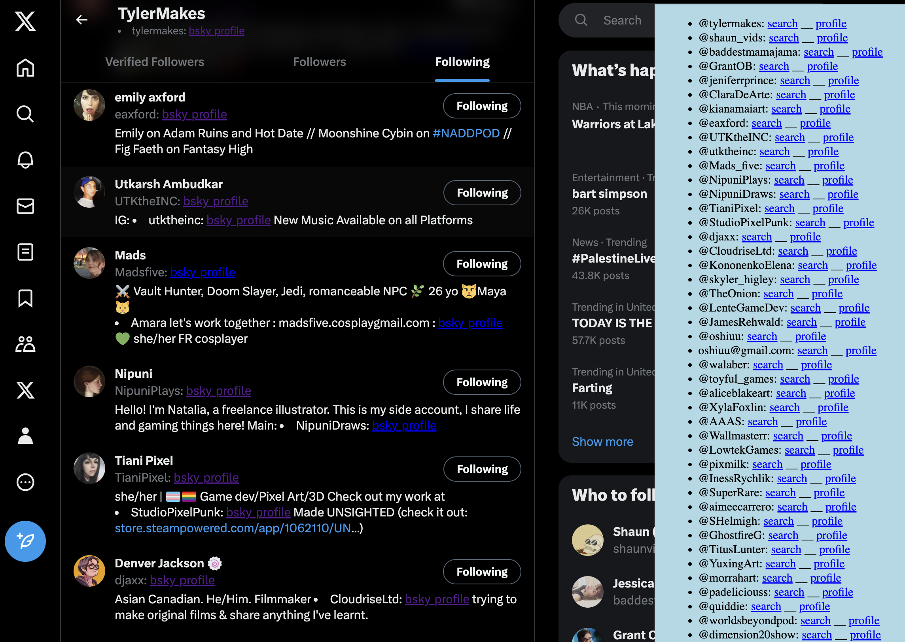
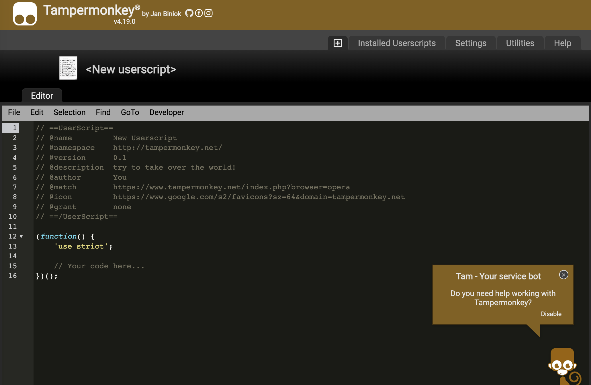

Are you trying to leave the hellscape that is Twitter?

Do you long for Bluer Skies?

Is the only thing that's stopping you the problem of finding all your friends way up here?

Then you've come to the right place!

------

I wrote this script to help myself find all the people I like on Twitter over on Blue Sky. It's a naive script for a few reasons (outlined way below if you really care), but it should help for many accounts nonetheless.

This script leverages the [TamperMonkey](https://www.tampermonkey.net/index.php) browser extension to insert links to BlueSky profiles on all the profiles you see on Twitter (see the pic below). It also keeps a running list on the side of all accounts on the page for easier access.

Click any of the bsky_profile links, and it will open BlueSky with that profile. Fortunately, many users use the same handle on Twitter as they do on BlueSky. If that doesn't work, the sidebar also has a link to open a search if you want to try that.

-------

## Installation

- Add the [TamperMonkey](https://www.tampermonkey.net/index.php) extension to your browser
    - [Chrome](https://www.tampermonkey.net/index.php?browser=chrome)
    - [Firefox](https://www.tampermonkey.net/index.php?browser=firefox)
    - [Safari](https://www.tampermonkey.net/index.php?browser=safari)
    - [OperaNext](https://www.tampermonkey.net/index.php?browser=opera)
    - [Edge](https://www.tampermonkey.net/index.php?browser=edge)
- Open the extension and click "Create new script"
- You should see the following screen:

- Copy the contents of the [BluerSkies.user.js](BluerSkies.user.js) into your TamperMonkey editor
- Click File > Save

## Usage
Once you've installed it, open Twitter (and log in if you haven't). You should now see profile links replaced with BlueSky links.

You should also be logged into BlueSky on the same browser.

Then, I recommend going to your Profile > Following (can be found  under your name next to your follower count) and scrolling through who you follow. As you scroll, the list on the right will fill, and you can go down the list opening profiles (I use CMD + click on Mac to open them into tabs so I can easily click through them).

That's it!

If you're not a regular TamperMonkey user, you can uninstall the extension when you're done to have one fewer things to worry about. Open your extensions manager and remove it.

Also, you can always turn off the extension temporarily if it's causing issues.

## Troubleshooting
The most likely issue is that you don't have TamperMonkey installed or you haven't enabled it.

If you're still having issues, you can reach out to me on [Twitter](https://twitter.com/tylermakes) or [BlueSky](https://bsky.app/profile/summitch.bsky.social).

## Why?
I wrote this in an hour last night in my frustration with Twitter and finding people on BlueSky. Because of that, I took the simplest approach.

I couldn't immediately find a simple API for either Twitter or BlueSky to grab followers from the former and add them to the latter. Though, in retrospect, TamperMonkey is better because it's harder for Twitter to stop if they don't like it.

### How are profiles matched?
I'm doing a simple check for the same profile names (minus underscores which aren't valid on BlueSky). If you're a Twitter user, I recommend you park the identical name on BlueSky even if you have a different account because it's the easiest way for people to find you. Also, post your BlueSky on Twitter!

